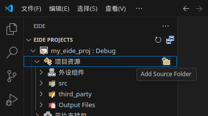

# Template of STM32 CubeMX project for EIDE

使用本模板前，请先安装 VSCode 及所需插件，见 [how_to_setup_eide_environment.md](how_to_setup_eide_environment.md)

## 模板做了些什么

- 添加了一些目录结构，各目录的作用请参阅其下的 readme.md 文件
- 给 `./src/**` 添加 -Wextra 编译参数，见 [debug.files.options.yml](eide_cubemx_template/.eide/debug.files.options.yml)（如果要修改，建议在 EIDE 中右键文件夹，选择 Modify Extra Complier Options）
- 修改了编译器选项，见 [debug.arm.options.gcc.json](eide_cubemx_template/.eide/debug.arm.options.gcc.json)
- 给 EIDE 添加了一些源文件夹和包含目录，见[eide.json](eide_cubemx_template/.eide/eide.json)

## 导出模板

要使用本模板，推荐先导出成 ept 文件

步骤：

1. 克隆或下载本仓库

2. 用 VSCode 打开工作区：eide_cubemx_template/eide_cubemx_template.code-workspace

    方法一：在 Windows 资源管理器中直接双击 .code-workspace 文件

    方法二：在 VSCode 中以文本文件形式打开 .code-workspace，然后点击右下角的 “打开工作区”

3. 导出模板：

    1. 点击 EIDE 选项卡
    2. 右键点击工程
    3. 选择 Export As... -> Eide Project Template（见下图）


然后会在 EIDE 工作区根目录生成一个 .ept 文件，这个文件就是本地模板文件

## 使用导出的模板

#### 1. 创建 EIDE 工程

1. 打开 VSCode，在 EIDE 选项卡中点击 New Project
2. 选择“本地项目模板“，然后打开上一节导出的本地模板文件
3. 为你的项目起一个名字，例如 my_eide_proj（记项目生成在 `xxx/my_eide_proj` 文件夹中）
4. 打开新创建的 EIDE 工作区（右下角会有提示，或者也可以手动打开 my_eide_proj.code-workspace）

#### 2. 使用 CubeMX 创建 STM32 工程

正常创建即可，但在 Project Manager 标签下，要选择以下设置：

- 工程名取一个你喜欢的，例如 my_eide_proj（也可以不与 EIDE 工程名相同）
- Toolchain/IDE 选择 STM32CubeIDE 并勾选 Generate Under Root
- Project Location 设为 `xxx/my_eide_proj/cubemx`（xxx/my_eide_proj 为 EIDE 项目文件夹）
- 在 Code Generator 页面下，选上以下选项：
    - Copy only the necessary library files
    - Generate peripheral initialization as a pair of '.c/.h' files per pperipheral

#### 3. 回到 EIDE 工作区，添加 CubeMX 生成的文件

**添加源文件：**

在 ` EIDE 选项卡 -> 项目资源` 点击“文件夹加号“图标（见下图），添加普通文件夹，选择刚才 CubeMX 生成的文件夹（例如 my_eide_proj）



**添加包含目录**：

1. 在 `my_eide_proj/.cproject` 中找到如下这段：

    > 在 VSCode 中，可以使用 `Ctrl + P` 搜索文件
    >
    > 在 .cproject 文件中搜索 Include，然后找最后一项可以快速找到
    
    ```xml
    <listOptionValue builtIn="false" value="../Core/Inc"/>
    <listOptionValue builtIn="false" value="../Drivers/STM32F4xx_HAL_Driver/Inc"/>
    <listOptionValue builtIn="false" value="../Drivers/STM32F4xx_HAL_Driver/Inc/Legacy"/>
    <listOptionValue builtIn="false" value="../Drivers/CMSIS/Device/ST/STM32F4xx/Include"/>
    <listOptionValue builtIn="false" value="../Drivers/CMSIS/Include"/>
    ```
    
2. 将其填入 `.eide/eide.json` 的 `incList` 中，并修改为对应格式如下：

    > 注意下面的 incList 还额外添加了 src 文件夹
    >
    > 使用 VSCode 列编辑的方法可以快速完成操作

    ```json
    "incList": [
        "src",
        "my_eide_proj/Core/Inc",
        "my_eide_proj/Drivers/STM32F4xx_HAL_Driver/Inc",
        "my_eide_proj/Drivers/STM32F4xx_HAL_Driver/Inc/Legacy",
        "my_eide_proj/Drivers/CMSIS/Device/ST/STM32F4xx/Include",
        "my_eide_proj/Drivers/CMSIS/Include"
    ],
    ```

**添加预处理宏定义**

1. 在刚才的 `cubemx/.cproject` 中搜索 `USE_HAL_DRIVER`，找到如下这段:

    ```xml
    <listOptionValue builtIn="false" value="DEBUG"/>
    <listOptionValue builtIn="false" value="USE_HAL_DRIVER"/>
    <listOptionValue builtIn="false" value="STM32F407xx"/>
    ```

2. 在 `EIDE 选项卡 -> 项目属性 -> 预处理宏定义` 中添加这几个宏
   
    > 模板已经添加了 USE_HAL_DRIVER
    >
    > DEBUG 可以不添加
    >
    > 要添加多个宏，可以用分号分隔，如 `USE_HAL_DRIVER;STM32F407xx`

**修改构建配置** 

1. 选择合适的 CPU 类型、链接脚本、硬件浮点选项

    - CPU 类型可以在 CubeMX 中查到（见下图）

    - 链接脚本为 .ld 文件，请找到类似于  `my_eide_proj/STM32xxx_FLASH.ld` 的文件，并填入相对路径

        不要选 `STM32xxx_RAM.ld` 的文件，除非你知道自己在干什么

    - 硬件浮点选项只在部分 CPU 类型中存在，如果有的话建议开启，可以提高浮点运算速度

        > single 类型的硬件浮点可以提高 float 计算速度，double 类型的可以提高 float 和 double 计算速度

    

**修改构建器选项** 

这里可以调整优化等级和一些编译选项，以下是常用优化等级：

- O0：最方便调试，但程序运行缓慢

- Og：在尽量保证调试体验的情况下优化运行效率。此时可能有一些变量被优化掉而无法在调试时查看，也会有一些函数被优化导致断点打不进去或单步调试时跳行

- O3：最大化运行效率，但调试体验非常差

通常在低优化等级下调试，调试完后再把优化等级开高

如果发现在低优化等级下程序运行正常，在高优化等级下运行异常，则原因可能有：

- 内存溢出，数组越界
- 爆栈了
- 存在线程安全、数据竞争等问题
- 编译器 bug

### 测试编译

点击 VSCode 右上角的 Build 按钮（如下图），编译


### 配置烧录器

按照你的情况配置烧录器。其中 OpenOCD 和 pyOCD 支持多种常见烧录器，JLink 和 STLink 只支持自家烧录器。

> OpenOCD 的版本不能太低，建议直接安装最新版。本模板测试时使用的是 0.12.0 版本

点击 Program Flash 按钮烧录（在 Build 按钮右边第二个）

## 工程说明

### 目录结构

- docs: 存放一些文档
- linker_script: 如果你修改了 ld 文件，请把修改后的文件放在这里
- src: 用于存放用户源代码
- .eide: EIDE 相关的配置文件
  - debug.files.options.yml: 可以给不同的文件指定不同的编译选项
- third_party: 用于存放第三方代码

## 一些可能用到的构建器选项

### 编译器选项

#### -Wextra

开启额外的 warning，这样会打印更多的 warning，更容易找到 bug

#### 选项：One ELF Section per Function 和 One ELF Section per Data

勾上这两个选项分别等价于添加 `-ffunction-sections` 和 `-fdata-sections` 编译选项。

`-ffunction-sections` 和 `-fdata-sections` 用于告诉编译器将每个函数和数据放在单独的段中，以便在链接时可以更好地优化代码大小。

#### -fno-exceptions

-fno-exceptions 是 GCC 编译器的一个选项，它表示禁用 C++ 异常机制。这个选项会让编译器生成更小、更快的代码，但是会使得程序无法使用 C++ 异常机制。如果你的程序中没有使用 C++ 异常机制，那么可以使用这个选项来优化你的程序。

#### -pipe

-pipe 选项告诉 GCC 使用管道而不是临时文件来在编译的各个阶段之间进行通信。这可以加快编译速度，特别是在 I/O 较慢的系统上。

#### -fno-rtti

-fno-rtti 选项告诉 GCC 不要生成与运行时类型信息有关的代码。这可以减小程序的大小并提高编译速度，但是会使得程序无法使用 RTTI（Run-Time Type Identification）功能。

#### --specs=nosys.specs

用于告诉链接器不使用系统调用（system calls）

标准 C 库中的一些功能（比如控制台输入输出、文件读写、获取时间）需要调用操作系统（如 Windows, Linux）提供的函数，这些函数称为 system calls。

但是 STM32 没有操作系统，所以也就没有这些函数（下注），于是链接时就会产生找不到这些函数的错误。加上 `--specs=nosys.specs` 之后，链接器就会自己弱定义这些函数，于是就不会产生上述错误了。

> （注）CubeMX 生成的代码里可能包括 syscalls.c 文件（取决于Toolchain/IDE配置），这里面就定义了所需 system calls. 所以如果有这个文件，也可以不添加这个编译选项

链接器自己定义的这些函数是空函数，不实现任何功能，只是用于去除链接错误的。

（如果你此时使用`printf`打印内容，由于`printf`最终会调用`_write()`，而`_write()`是空函数，所以并不会有任何东西打印出来）

当然，你也可以自己实现一些系统调用。例如，实现一个将信息输出到串口的 `_write()`，从而使得 `printf` 能够打印到串口。链接器会优先链接你定义的这些函数。如果你将所有的系统调用都定义了，就可以不加 `--specs=nosys.specs`

#### --specs=nano.specs

用于告诉编译器和链接器使用 Nano libc

Nano libc 是一个轻量级的 C 库，它的目标是减小可执行文件的大小。使用 Nano libc 可以减小可执行文件的大小，但是会牺牲一些功能。

**注意：**如果要使用 Nano libc, 请在编译器选项中添加这个选项，不要在链接器选项中添加。在编译器选项中加会同时作用于编译器和链接器，而在链接器选项中加只会作用于链接器，从而导致一些问题，详情见：[issue](https://github.com/github0null/eide/issues/259)。

Nano libc 默认关闭了 printf 和 scanf 浮点数的功能。如果要使用该功能，需要在链接器选项中添加 `-u _printf_float` 和 `-u _scanf_float`

不添加 `--specs=nano.specs` 则会使用标准 C 库。标准 C 库默认支持 printf 和 scanf 浮点数，因此使用标准 C 库时不用添加 `-u _printf_float` 和 `-u _scanf_float`

### 链接器选项

#### 选项：Remove Unused Input Sections

勾上这个选项等价于添加 `-Wl,--gc-sections` 编译选项。

其中，`-Wl` 是 GCC 的编译选项，用于将后面的参数传递给链接器。`--gc-sections`用于告诉链接器在链接时删除未使用的段。

因此，勾上这个选项以及编译器选项里的 `One ELF Section per Function` 和 `One ELF Section per Data`，可以实现删除未使用的函数和数据。

### 链接库

使用 `-lLibraryName` 链接名称为 `LibraryName` 的库。

以下为常用链接库选项：

- `-lm`：数学库，提供了 math.h 中的各种数学函数。（有时候编译器会自动帮你链接这个库）
- `-lstdc++`: C++ 标准库

> 编译时使用 `gcc` 会自动链接 C 库，但不会自动链接 C++ 库；  
> 编译时使用 `g++` 会自动链接 C++ 库；  
> 所以通常情况下使用 `gcc` 编译 .c 文件，使用 `g++` 编译 .cpp 文件  
> 但 EIDE 编译 .cpp 文件时也使用 `gcc` 命令，所以必须手动指定要链接 C++ 库
